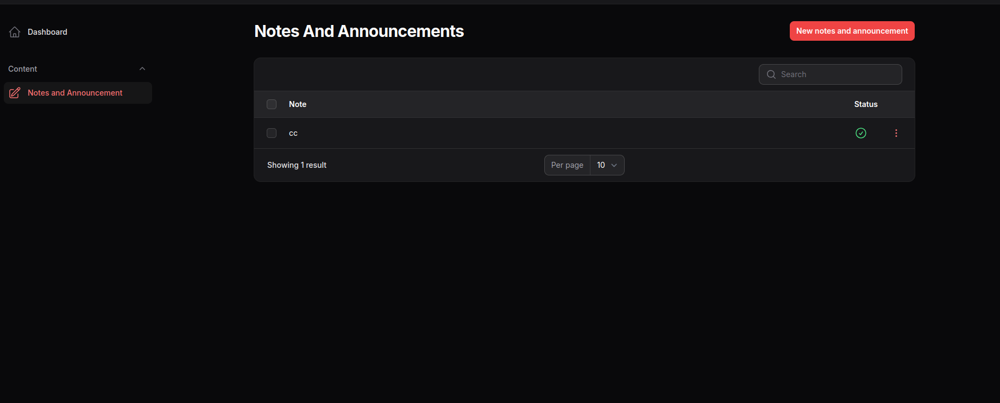
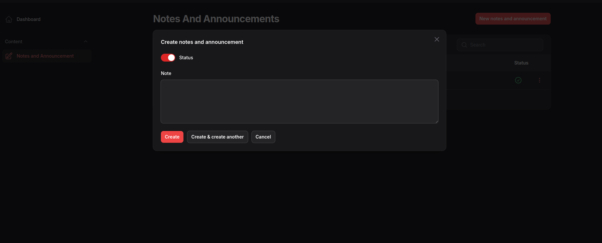

# Filament Notes and Announcement

A filament plugin for save frontend customer notes and announcements

## Installation

Install Using Composer

```
composer require cwsps154/filament-notes-and-announcement
```
Run

```
php artisan filament-notes-and-announcement:install
```

## Usage/Examples

Add this into your Filament `PannelProvider` class `panel()`
```
$panel->plugins([FilamentNotesAndAnnouncementPlugin::make()]);
```

You can limit the access to the resources
```
FilamentNotesAndAnnouncementPlugin::make()
                        ->canViewAny('have-access', 'view-notes-and-announcement')
                        ->canCreate('have-access', 'create-notes-and-announcement')
                        ->canEdit('have-access', 'edit-notes-and-announcement')
                        ->canDelete('have-access', 'delete-notes-and-announcement')

```

You can publish the config file `filament-notes-and-announcement.php`, by running this command

```
php artisan vendor:publish --tag=filament-notes-and-announcement-config
```

which contains these settings

```
return [
    'layout' => null,
    'cluster' => null,
    'navigation' => [
        'title' => 'filament-notes-and-announcement::notes-and-announcement.notes.and.announcement',
        'group' => 'filament-notes-and-announcement::notes-and-announcement.group',
        'label' => 'filament-notes-and-announcement::notes-and-announcement.notes.and.announcement',
        'icon' => 'heroicon-o-pencil-square',
        'sort' => 100,
        'buttons' => [
            'create' => 'filament-notes-and-announcement::notes-and-announcement.create.button',
        ]
    ]
];
```

## Screenshots




